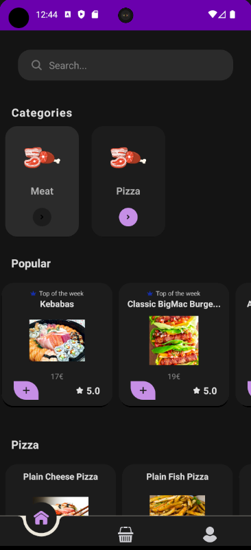
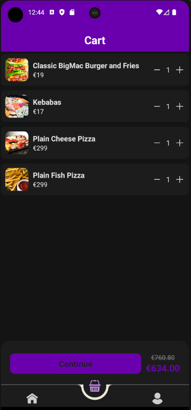
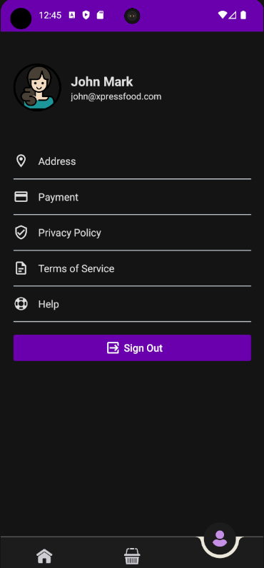

# Delivery Application 🚚🍔

Welcome to the **Delivery Application** repository! This project is a food delivery application that allows users to browse categories, view popular items, add items to a cart, and place orders efficiently. It includes a user-friendly interface with smooth navigation and advanced cart management features.

## 📌 About the Delivery Application

The **Delivery Application** is designed to provide a seamless food ordering experience. With intuitive navigation, detailed product views, and cart functionality, users can easily select and manage items for checkout.

## ✨ Features

- 🍕 **Home Screen:**
  - Displays categories such as Meat and Pizza.
  - Highlights popular items of the week with ratings.
  - Search functionality to find desired products.

- 🛒 **Cart Screen:**
  - Users can view selected items with real-time quantity adjustments.
  - Displays subtotal and total price with discounts applied.

- 👤 **Profile Screen:**
  - Allows users to update their address and payment details.
  - Provides access to Privacy Policy, Terms of Service, and Help sections.
  - Secure **Sign Out** option.

## 🖼 Screenshots

### **Home Screen**
     

### **Cart Screen**

### **Profile Screen**

## 🚀 Technologies Used

- **Frontend:** React Native
- **Backend:** PHP
- **Database:** MySQL
- **State Management:** Context API for managing cart and user data
- **Icons:** FontAwesome, Entypo, AntDesign

## 📩 Contact

For any inquiries or collaborations, feel free to reach out:

📧 Email: [enes.nadirt@gmail.com](mailto:enes.nadirt@gmail.com)

## 📜 License

This project is licensed under the MIT License - feel free to modify and use it.

---

### 🔥 How to Contribute

If you'd like to contribute:

1. Fork this repository.
2. Create a new branch (`feature-branch`).
3. Make your changes and commit them.
4. Push to your branch and submit a Pull Request.

Let's enhance the **Delivery Application** together! 🚚🍔
